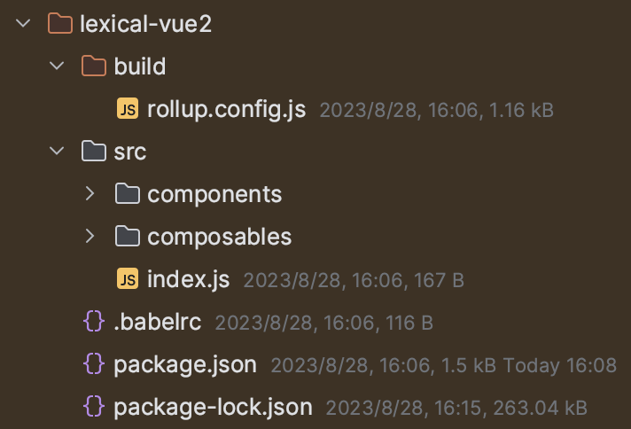

# 如何通过自定义仓库的形式来安装facebook/lexical
 
- 如何安装任意一个github仓库的子路径到项目中
- 如何使得[facebook/lexical](https://github.com/facebook/lexical)一整个打包的仓库变成拆分打包
- 如何自定义任意一个[facebook/lexical](https://github.com/facebook/lexical)的子仓库且只需要import自己自定义的仓库
  在这篇文章中你可以解决以上的问题

# 前言

[facebook/lexical](https://github.com/facebook/lexical)
是一个强大的富文本编辑器框架，但是仍然处于一个发展中的阶段，这个时候就很需要我们自定义源代码，但这个时候就有一个问题，我们如何在自己的项目中引用我们自定义的lexical包呢？现在有两个办法

1. fork facebook/lexical的仓库，然后修改所有的包引用为自己的包名
    - 比如lexical改为@meogic/lexical
    - lexical-markdown改为@meogic/lexical-markdown
2. 使用类似gitpkg的方法，只打包和引入一个github仓库的子文件夹作为包

# 尝试寻找解决办法

第一个方法看起来很容易，没有什么技术难度，但是这种办法只会临时有效，后续lexical肯定会持续更新版本，你不可能一直保持旧有的不稳定的版本，然后你一旦尝试sync
fork最新的代码，就会有大量的冲突向你袭来，所有你修改过的包引用的文件都会报错

那么只能采用第二种办法了！

这似乎很容易，这里拿lexical-markdown来举例，我们访问 https://gitpkg.now.sh/api/pkg?url=facebook/lexical/packages/lexical-markdown
这个时候页面报错了！

// TODO 图片

## 尝试深入gitpkg与gh2npm

gitpkg你会发现它是用now来编写的，实际上后面更新为了vercel，它的部署是通过vercel serverless
function的功能来部署上线的，所以你在线上只用访问 https://gitpkg.now.sh 即可
但问题是报错500了，你如何在本地调试呢？
我在gitpkg的issue里通过搜索`500`关键词找到了这个人提供的方法
https://github.com/EqualMa/gitpkg/issues/25#issuecomment-1587061121

> I faced the same issue of`500 server error`when i added few static assets to one of the packages we use via`gitpkg`.
must be due to increased file size. so i created a simpler self hostable version without relying on vercel. it's very
simple and have fraction of flexibility offered by`gitpkg`but sharing it if anyone is interested in using for their own
projects.[https://github.com/Super-Chama/gh2npm](https://github.com/Super-Chama/gh2npm)
>
> [@EqualMa](https://github.com/EqualMa)thanks for creating`gitpkg`and`tar-transform`it was very inspiring

这引起了我的好奇，通过下载gh2npm源码在本地运行后发现，不管是gitpkg还是gh2npm本质上的原理都是[npm install \<tarball url\>](https://docs.npmjs.com/cli/v9/commands/npm-install#description:~:text=npm%20install%20%3Ctarball%20url%3E%3A)
但是gh2npm只支持一个层级，这就需要我们修改源码来使其能够支持两个层级的筛选啦。实现了对应的功能后，我通过npm命令试了一下，果然可以了

```json
// file package.json
{
	"dependencies": {  
		"lexical-vue2": "http://localhost:3000/aquarius-wing/lexical-vue2/packages/lexical-vue2"  
		}
}
```

这里使用的是让lexical跑在vue2环境上的仓库[aquarius-wing/lexical-vue2](https://github.com/aquarius-wing/lexical-vue2)
运行了安装命令后果然在node_modules中看到了它

但是问题是只有源码，没有对应的dist文件夹，所以需要我们有如下的操作

```json
// file package.json
{
	"scripts": {
		"postinstall": "cd node_modules/lexical-vue2 && npm install && npm run build && rm -rf node_modules"  
	},
}
```

这里有四个步骤，在执行`npm install`完成之后

1. 进入`node_modules/lexical-vue2`文件夹
2. 执行`npm install`命令，可以根据情况改成对应的`yarn` ，`pnpm`
3. 执行`npm build`命令，根据项目情况可以换成对应的打包命令
4. 执行`rm -rf node_modules`命令，清除安装产生的文件，因为这一步产生的文件在我们项目中是不需要的，所以要及时删除，避免占用不必要的硬盘空间

# 实现安装任意一个github仓库的子路径到项目中

到这里才算真正完成了我们想要的效果

...未完待续

# 干货

- facebook/lexical是整体打包的，我们需要改成单个打包的
- gitpkg是通过vercel serverless function来部署的，不便于本地调试，代码中提供的build命令仅仅限于打包vuepress生成的文档页面
- 通过gitpkg来安装github仓库本质上基于[npm install <tarball url\>](https://docs.npmjs.com/cli/v9/commands/npm-install#description:~:text=npm%20install%20%3Ctarball%20url%3E%3A)来实现

- gh2npm是一个可以将github仓库的子文件夹转换成新的tarball文件的仓库，但是只支持一个层级