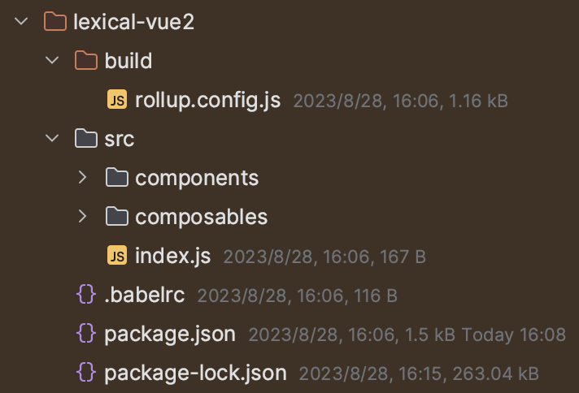

- How to install any subpath of a GitHub repository into your project

- How to make the entire packaged repository of [facebook/lexical](https://github.com/facebook/lexical) become split
  packaging

- How to customize any sub-repository of [facebook/lexical](https://github.com/facebook/lexical) and only need to import
  your own customized repository

In this article, you can solve the above problems.

# Preface

[facebook/lexical](https://github.com/facebook/lexical)

is a powerful rich text editor framework, but it is still in a developmental stage. At this time, we need to customize
the source code. But then there's a problem: how do we reference our customized lexical package in our own projects?
Currently, there are two methods:

1. Fork the facebook/lexical repository and modify all package references to your own package name.

   - For example, change lexical to @meogic/lexical

   - Change lexical-markdown to @meogic/lexical-markdown

2. Use a method similar to gitpkg that only packages and imports a subfolder of a GitHub repository as a package.

# Try to find a solution

The first method seems easy, there is no technical difficulty, but this method will only be temporarily effective. The
subsequent lexical will definitely continue to update the version. You can't always keep the old unstable version, and
once you try to sync.

When you fork the latest code, there will be a lot of conflicts coming at you. All files referenced by packages that you
have modified will report errors.

So we can only adopt the second method!

This seems easy. Here we take lexical-markdown as an example. We
visit https://gitpkg.now.sh/api/pkg?url=facebook/lexical/packages/lexical-markdown

At this time, the page reports an error!

// TODO image

## Delving into gitpkg and gh2npm

You will find that gitpkg is written using 'now', which was actually updated to 'vercel' later. Its deployment is done
through the functionality of vercel serverless function, so you only need to visit https://gitpkg.now.sh online.

But the problem is that it's throwing a 500 error, how do you debug this locally?

I found this method provided by someone in the issue section of gitpkg by searching for the keyword `500`.

https://github.com/EqualMa/gitpkg/issues/25#issuecomment-1587061121

> I faced the same issue of`500 server error`when i added few static assets to one of the packages we use via`gitpkg`.
must be due to increased file size. so i created a simpler self hostable version without relying on vercel. it's very
simple and have fraction of flexibility offered by`gitpkg`but sharing it if anyone is interested in using for their own
projects.[https://github.com/Super-Chama/gh2npm](https://github.com/Super-Chama/gh2npm)
>
> [@EqualMa](https://github.com/EqualMa)thanks for creating`gitpkg`and`tar-transform`it was very inspiring

This piqued my curiosity, and after downloading and running the gh2npm source code locally, I found that both gitpkg and
gh2npm essentially operate on the principle
of [npm install \<tarball url\>](https://docs.npmjs.com/cli/v9/commands/npm-install#description:~:text=npm%20install%20%3Ctarball%20url%3E)

However, gh2npm only supports one level, so we need to modify the source code to make it support two levels of
filtering. After implementing the corresponding function, I tried it with an npm command and sure enough it worked.
```json
// file package.json
{
	"dependencies": {  
		"lexical-vue2": "http://localhost:3000/aquarius-wing/lexical-vue2/packages/lexical-vue2"  
		}
}
```

The repository [aquarius-wing/lexical-vue2](https://github.com/aquarius-wing/lexical-vue2) is used here to run lexical
in a vue2 environment.

After running the installation command, it indeed appeared in node_modules



But the problem is that there are only source codes and no corresponding dist folder, so we need to perform the
following operations.

```json
// file package.json
{
	"scripts": {
		"postinstall": "cd node_modules/lexical-vue2 && npm install && npm run build && rm -rf node_modules"  
	},
}
```

There are four steps to follow after executing `npm install`:

1. Enter the `node_modules/lexical-vue2` folder

2. Execute the `npm install` command, which can be changed to corresponding commands like `yarn`, or `pnpm` as per your
   situation.

3. Execute the `npm build` command, you can switch it to a corresponding packaging command based on your project's
   needs.

4. Run the `rm -rf node_modules` command to clear files generated by installation because these files are not needed in
   our project and should be deleted promptly to avoid occupying unnecessary disk space.

# Implement the installation of any subpath from a GitHub repository into the project

Only here can we truly achieve the effect we want.

...To be continued

# Key Points

- facebook/lexical is packaged as a whole, we need to change it to individual packaging

- gitpkg is deployed through vercel serverless function, which is not convenient for local debugging. The build command
  provided in the code is only for packaging the document pages generated by vuepress

- Installing github repositories via gitpkg essentially relies
  on [npm install <tarball url\>](https://docs.npmjs.com/cli/v9/commands/npm-install#description:~:text=npm%20install%20%3Ctarball%20url%3E)

- gh2npm is a repository that can convert subfolders of github repositories into new tarball files, but it only supports
  one level